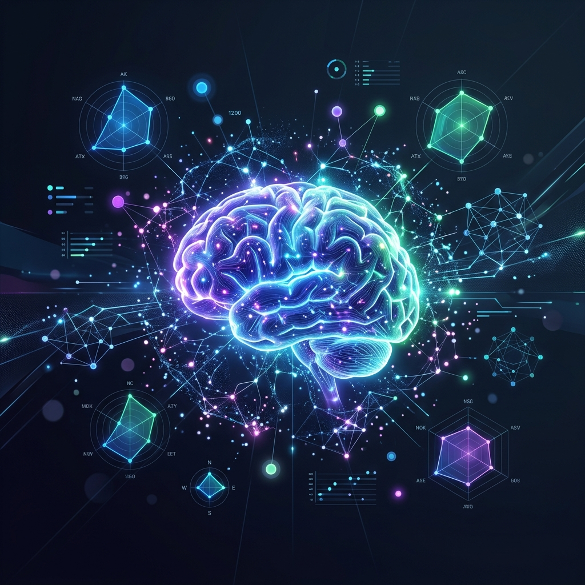
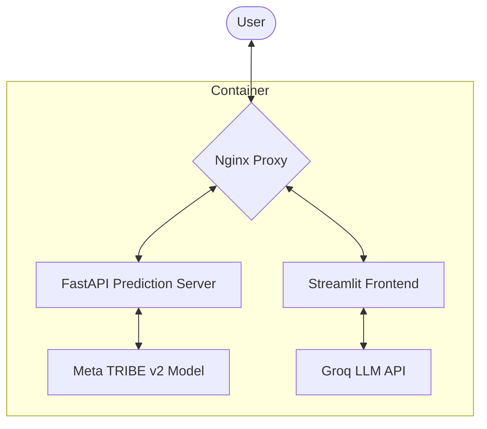

<div align="center">
  
</div>

# 🧠 TribeMind — Brain Response Visualizer

[](LICENSE)
[](https://www.python.org/)
[](https://ai.meta.com/blog/tribe-v2-brain-predictive-foundation-model/)
[](https://groq.com/)

**TribeMind** is a state-of-the-art neuroscience application that predicts and visualizes brain activity in response to tri-modal inputs (Image, Video, Text). Powered by **Meta's TRIBE v2 fMRI foundation model** and **Groq LLM**, it bridges the gap between raw data and human-centric neuroscience insights.

---

## ✨ Core Features

| Feature | Description |
| :--- | :--- |
| **🖼️ Tri-modal Input** | Analyze images, videos, or raw text to see how the brain reacts. |
| **🌍 23 ROI Mapping** | Mapped across 7 functional systems (Vision, Emotion, Memory, Social, etc.). |
| **📊 Interactive Viz** | Radar charts, system breakdowns, and region-specific activation bars. |
| **🧬 Neuro-Scores** | Composite scores for *Attention Capture*, *Memorability*, and *Reward Activation*. |
| **🤖 AI Synthesizer** | Personalized neuroscience summaries generated by LLMs via Groq. |
| **🎓 Research Mode** | Deep-dives into reward circuits and dopaminergic pathways for educational use. |

---

## 🏗️ Architecture & Flow

TribeMind uses a robust, proxy-managed containerized stack to ensure seamless communication between the neural model and the user interface.



---

## 🚀 Getting Started

### 🐳 Quick Start with Docker (Recommended)

The easiest way to get up and running is using Docker Compose.

1.  **Clone & Configure**
    ```bash
    git clone https://github.com/mananjp/tribemind.git
    cd tribemind
    cp .env.example .env
    # Add your GROQ_API_KEY to .env
    ```

2.  **Deploy**
    ```bash
    docker compose up --build -d
    ```
    Access the app at `http://localhost`.

### 🐍 Local Development

1.  **Environment Setup**
    ```bash
    python -m venv .venv
    source .venv/bin/activate  # Windows: .venv\Scripts\activate
    pip install -r requirements.txt
    ```

2.  **Run Services**
    *   **Backend**: `python server.py` (Runs on port 8000)
    *   **Frontend**: `streamlit run app.py` (Runs on port 8501)

---

## 🔧 Configuration

| Variable | Description | Default |
| :--- | :--- | :--- |
| `GROQ_API_KEY` | Your Groq Cloud API Key | *Required* |
| `TRIBE_BACKEND_URL` | Endpoint for the TRIBE inference server | `http://localhost:8000` |

---

## 📚 Educational Grounding

The **Educational Research Mode** provides insights derived from peer-reviewed literature:
*   **Reward Cycles**: Berridge & Kringelbach (2015)
*   **Dopamine Pathways**: Schultz (2015)
*   **Social Cognition**: Haber & Knutson (2010)

> [!NOTE]
> All content analysis is presented for academic understanding of brain function.

---

## 📄 License & Attribution

- **Model**: Powered by [Meta TRIBE v2](https://ai.meta.com/blog/tribe-v2-brain-predictive-foundation-model/).
- **AI**: Summaries powered by [Groq](https://groq.com/).
- **Usage**: Restricted to educational and research use.

---
<div align="center">
  Proudly built for the future of educational neuroscience.
</div>
