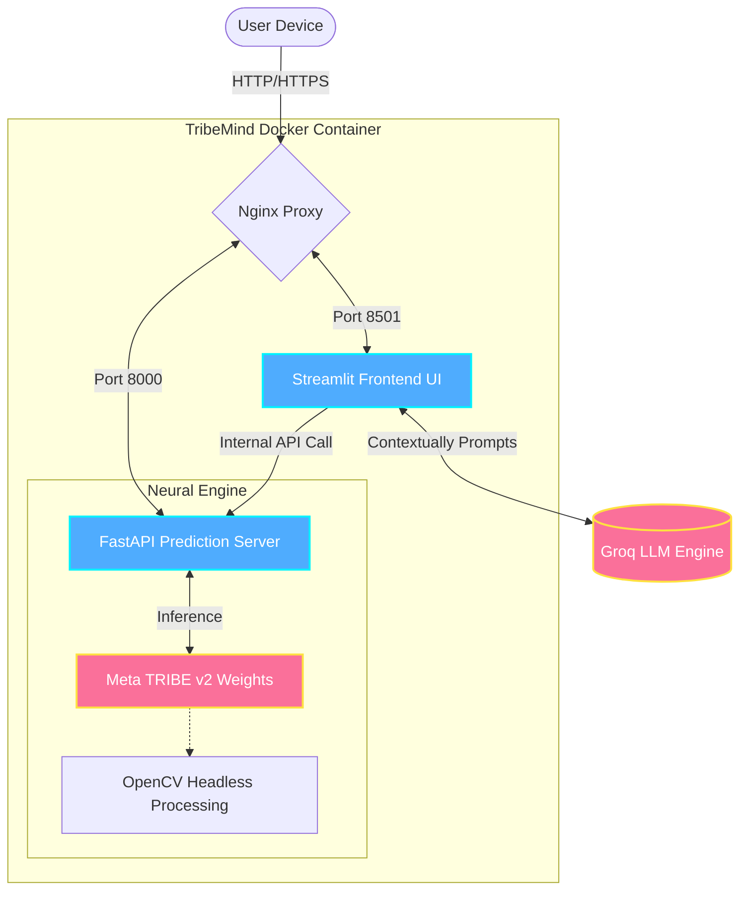

<div align="center">
  
</div>

<div align="center">
  <h1>🧠 TribeMind</h1>
  <h3>The Next-Generation Brain Response Visualizer</h3>
  
  [](LICENSE)
  [](https://www.python.org/)
  [](https://ai.meta.com/blog/tribe-v2-brain-predictive-foundation-model/)
  [](https://groq.com/)
  <br>
  [](https://huggingface.co/spaces/Mananjp/Tribemind)
  
  *Predict and visualize how the human brain responds to multimedia—in real time.*
</div>

---

## 🌟 Introduction

**TribeMind** is a state-of-the-art educational neuroscience application that predicts and visualizes brain activity in response to tri-modal inputs (Image, Video, Text). 

By bridging the gap between raw functional MRI (fMRI) data and human-centric insights, TribeMind leverages **Meta's TRIBE v2 foundation model** to simulate neural activations. The raw predictions are then synthesized into digestible, personalized neuroscience reports using ultra-fast LLMs powered by **Groq Cloud**.

Get a front-row seat to the cognitive orchestra of the human mind:
- **Educators** can demonstrate which brain regions activate when reading emotionally charged text.
- **Researchers** can test hypotheses on visual stimuli impact.
- **Students** can dive into the rich interplay between the *Reward System*, *Visual Cortex*, and *Social Cognition* networks.

---

## ✨ Core Features

| Feature | Description |
| :--- | :--- |
| **🖼️ Tri-modal Input Layer** | Analyze static images, dynamic videos, or raw text prompts to simulate brain reactions. |
| **🌍 23 ROI High-Fidelity Mapping** | Neurological mapping across 7 critical functional systems (Vision, Emotion, Memory, Social, Auditory, Language, and default networks). |
| **📊 Interactive Visualization** | Beautifully rendered radar charts, system breakdowns, and region-specific top-activation bars using Plotly. |
| **🧬 Cognitive Neuro-Scores** | Proprietary composite scoring for *Attention Capture*, *Memorability*, and *Reward Activation* to synthesize raw data. |
| **🤖 AI Synthesizer** | Personalized neuroscience summaries generated by Groq LLMs to translate raw fMRI vector data into plain English. |
| **🎓 Educational Research Mode** | Focused deep-dives into reward circuits (NAcc, VTA) and dopaminergic pathways for verified academic literature use. |

---

## 🏗️ Architecture & Flow

TribeMind uses a robust, proxy-managed containerized stack designed for both high-performance edge deployment (like Hugging Face Spaces) and scalable local execution.



> [!NOTE]
> The internal API and WebSockets are hard-proxied via Nginx. This natively handles XSRF bypasses and Chunked file uploads (up to 100MB) without memory saturation, guaranteeing zero connection drops on strictly proxied environments like Hugging Face.

---

## 🚀 Getting Started

### 🐳 Quick Start with Docker (Recommended)

The easiest way to get up and running is using our Docker Compose environment. We bundle Nginx, FastAPI, and Streamlit into a single manageable pod.

1.  **Clone the Repository & Configure Secrets**
    ```bash
    git clone https://github.com/mananjp/tribemind.git
    cd tribemind
    cp .env.example .env
    ```
    *Don't forget to open `.env` and add your `GROQ_API_KEY` to unlock the AI Synthesizer!*

2.  **Deploy the Stack**
    ```bash
    docker compose up --build -d
    ```
    Wait ~15 seconds for the engines to boot, then access the app at `http://localhost`.

### 🐍 Local Development (Bare Metal)

If you prefer to run the services outside a container:

1.  **Environment Setup**
    ```bash
    python -m venv .venv
    
    # Activate virtual environment
    source .venv/bin/activate    # Linux/Mac
    # .venv\Scripts\activate     # Windows
    
    pip install -r requirements.txt
    ```

2.  **Run Services (Requires two terminals)**
    *   **Terminal 1 (Backend Engine)**: `python server.py` (Binds to port 8000)
    *   **Terminal 2 (Frontend Client)**: `streamlit run app.py` (Binds to port 8501)

---

## 🔧 Deployment Configuration

Control the behavior of the application via standard Environment Variables:

| Variable | Importance | Description | Default |
| :--- | :--- | :--- | :--- |
| `GROQ_API_KEY` | **Required** | Your Groq Cloud API Key for generating LLM insights. | _None_ |
| `TRIBE_BACKEND_URL` | Optional | The HTTP endpoint for the internal TRIBE inference server. | `http://localhost:8000` |
| `HF_TOKEN` | Optional | Used if downloading gated weights or pushing to Spaces. | _None_ |

---

## 📚 Educational Grounding

TribeMind was designed with verifiable neuroscience literature at its core. The **Educational Research Mode** provides context-aware insights derived directly from leading peer-reviewed literature, including:

*   **Reward Cycles & Hedonic Hotspots**: Berridge & Kringelbach (2015)
*   **Dopamine Pathways & Prediction Errors**: Schultz (2015)
*   **Social Cognition & Empathy**: Haber & Knutson (2010)

> [!IMPORTANT]  
> All content analysis within TribeMind is presented **strictly** for the academic understanding of brain function. It is not intended for clinical, therapeutic, or diagnostic use.

---

## 📄 License & Attribution

- **Foundation Model**: Powered by [Meta TRIBE v2](https://ai.meta.com/blog/tribe-v2-brain-predictive-foundation-model/).
- **AI Synthesis**: Summaries generated by ultra-fast inference via [Groq](https://groq.com/).
- **Usage Rights**: Subject to Meta's Research-Only licensing. Restricted to educational and research use. 

<br>
<div align="center">
  <i>Proudly built for the future of interactive educational neuroscience.</i>
</div>
